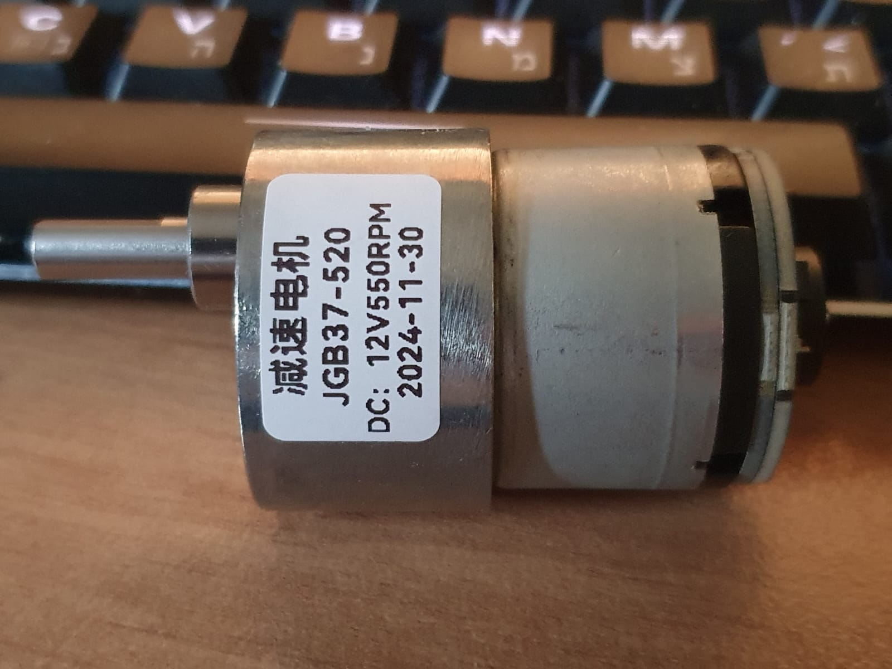
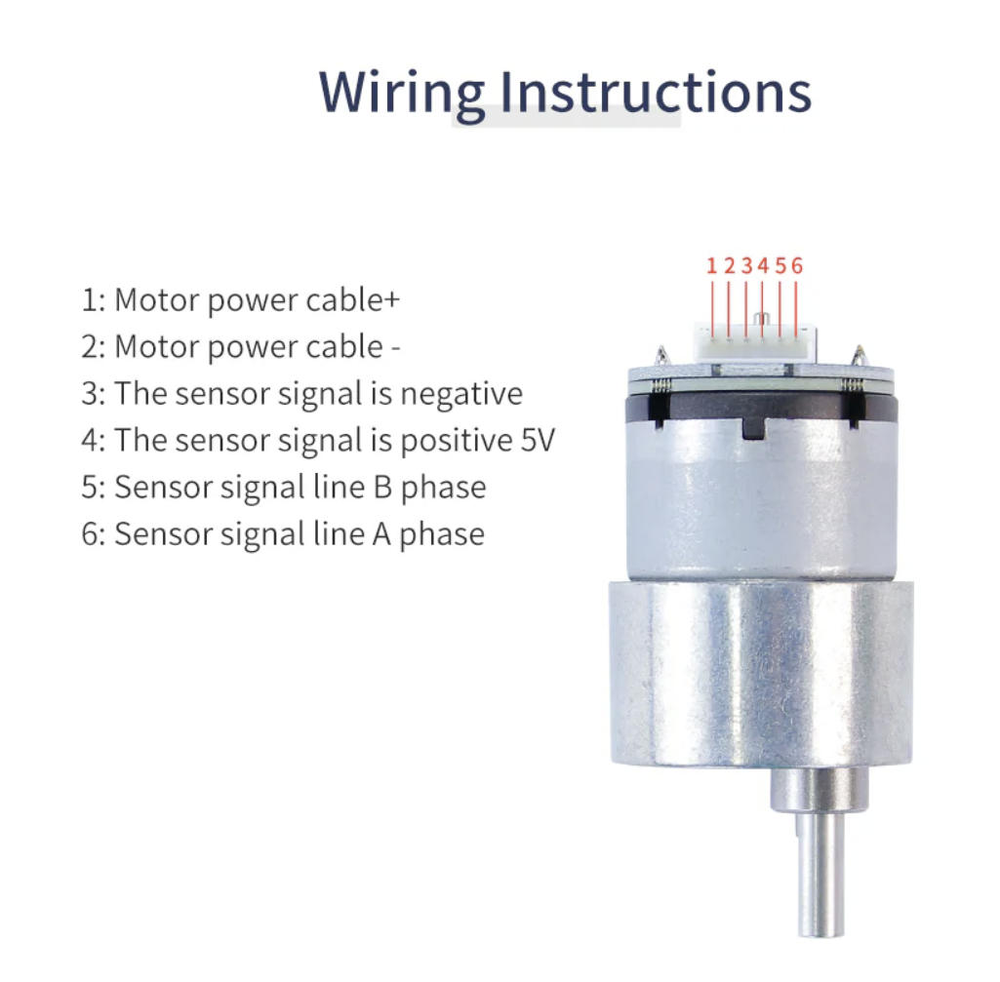
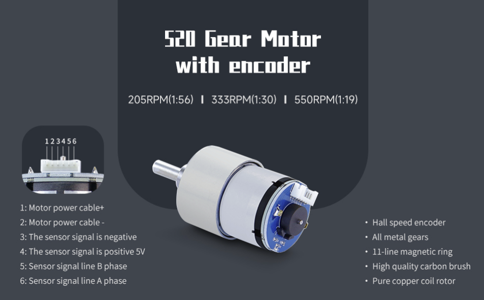

# 2-Wheeler Controlled by Raspberry PI PICO-2W
Using excellent official Raspberry Pi Pico Extension for VSCode by raspberrypi.com

## Getting started
1. Clone the repo
   ```bash
   git clone https://github.com/alxliv/Robotics.git

## Hardware:
Two DC Motors - 520 Gear Motor With Encoder





## License

This project is licensed under the [MIT License](LICENSE).