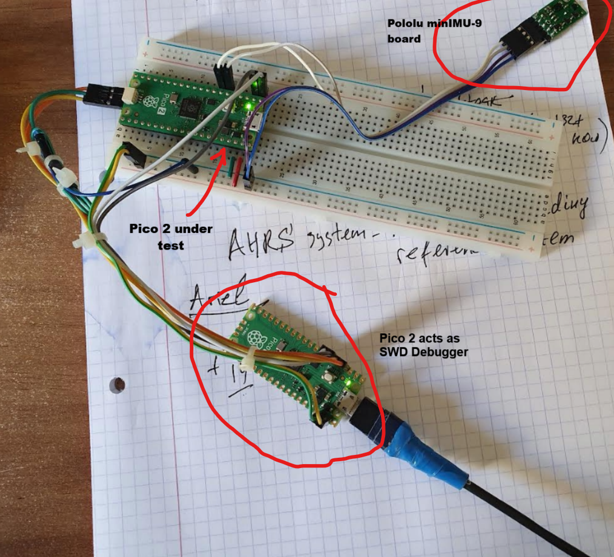

Pico 2 that acts as a SWD debugprobe should be loaded with **debugprobe_on_pico2.uf2** from https://github.com/raspberrypi/debugprobe/releases/tag/debugprobe-v2.2.2
Read https://www.raspberrypi.com/documentation/microcontrollers/pico-series.html#debugging-using-another-raspberry-pi-pico


>[!TIP]
> If, during project create, you omit to specify *use UART for stdio* - for printf() over serial port,
>  you can always add it later to CMakeLists.txt like this:
```
target_link_libraries(pololu_minImu_9
        pico_stdio_uart
        )
```

>[!IMPORTANT]
>Raspberry PI PIco Project Extension -> before **Debug Project** - always select Build Type to *Debug* (use Switch Build Type)
